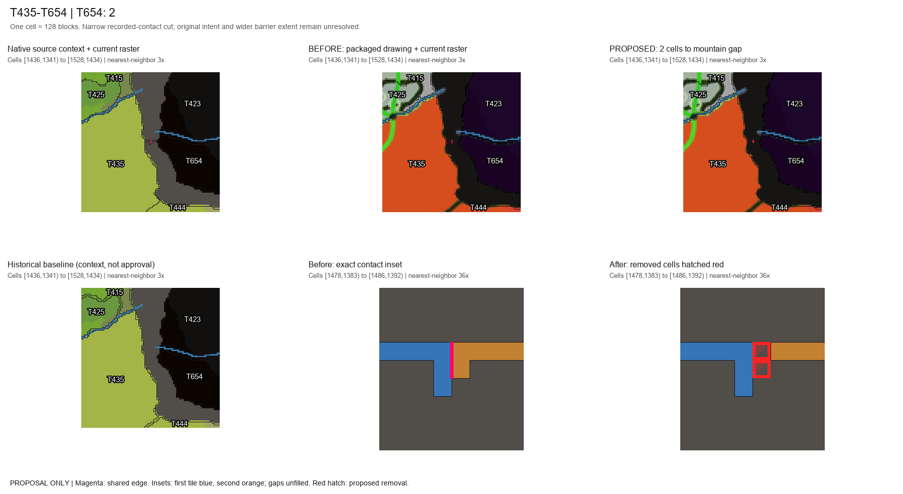
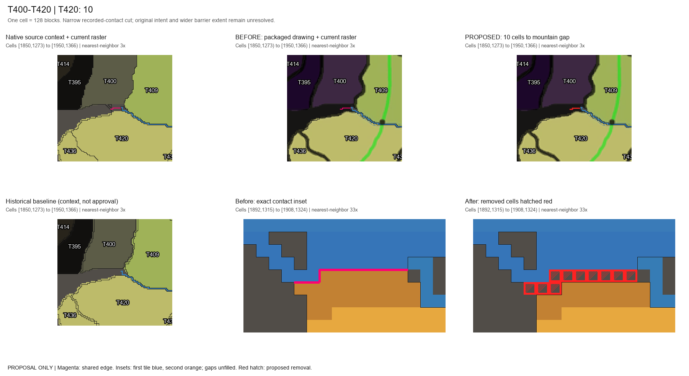
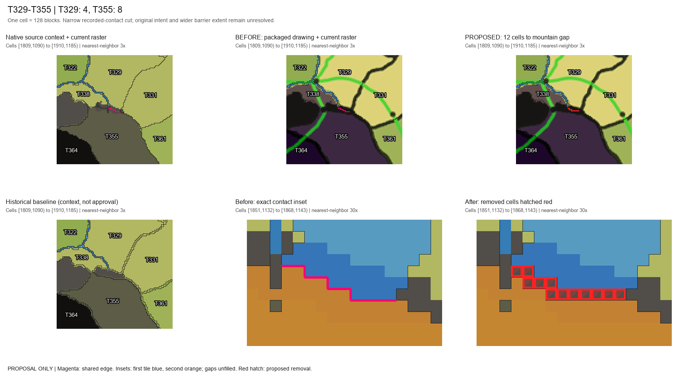
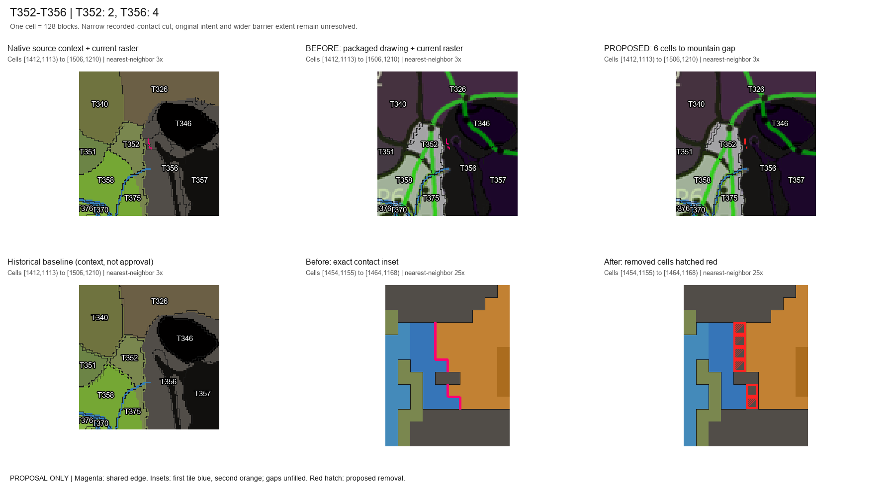
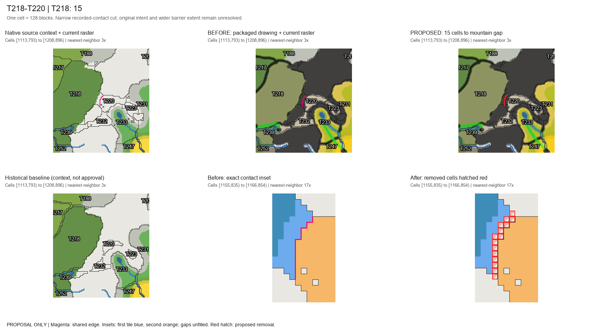
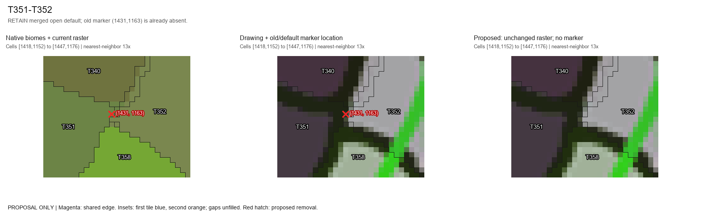
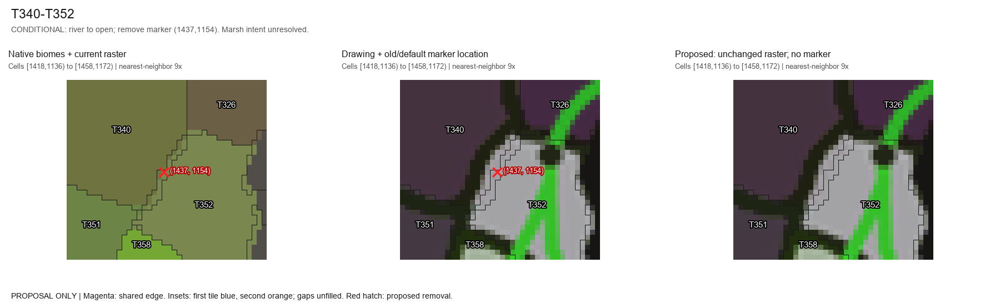
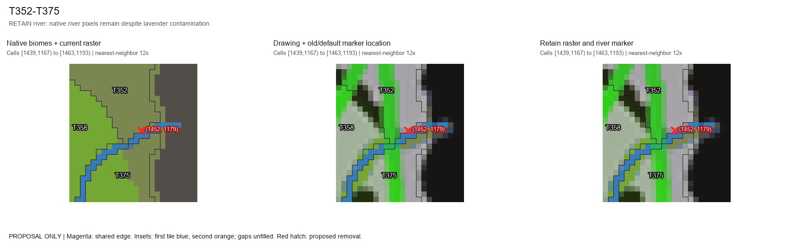
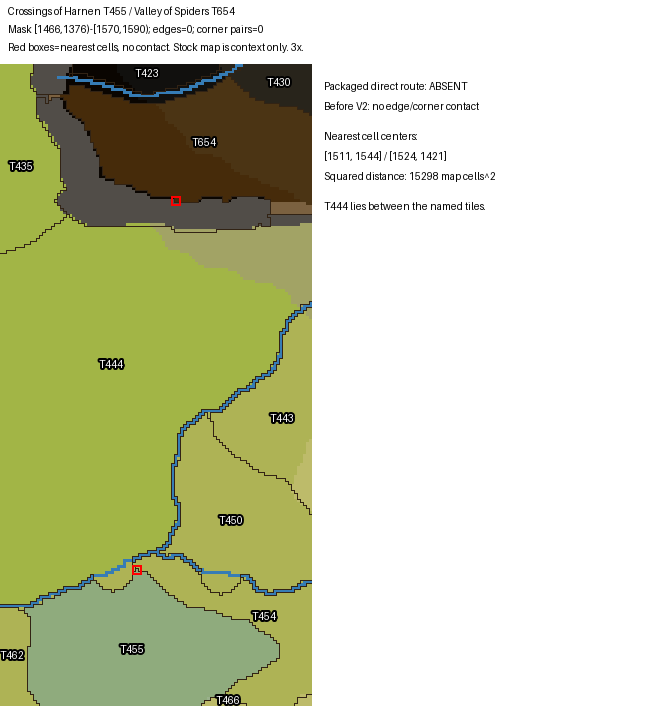

# KOM-59 geography decision review

**Proposals only.** Based on current dev `26ba6cb7d1bbe7d4e0e4482b4f5855e15747c04d`. The five mountain cuts total **45 exact cells**. Original drawing intent remains an explicit approval decision; native biome identity and decorative colors do not supply approval. No production raster, exclusions, routes, markers or saved state were changed.

## Decision table

The five mountain proposals, conditional T340/T352 change and unresolved Harnen report are separate decisions. Each crop embeds native context, packaged source context and annotated before/proposed-after views. Open the image for exact-cell insets. The original hand-drawn source and intended complete barrier boundaries were not authenticated. A normal shared border should permit direct strategic passage unless intended geography establishes a real barrier; if a legitimate pass or ordinary border is confirmed, retain the geometry and approve its direct permitted edge instead of applying a mountain cut.

| Class | Contact | Current evidence | Smallest recommendation / topology | Decision still needed | Before / proposed after |
|---|---|---|---|---|---|
| Mountain proposal | T435-T654 | 5 contact cells; (1481,1386)-(1482,1388); all native Mordor Mountains. Historical baseline: all GAP. | 2 cells from T654; retain absent edge. No route either way. | Approve this narrow mountain separation and exact manifest. Packaged drawing supports the range; original hand-drawn intent, width and full extent are not independently verified. |  |
| Mountain proposal | T400-T420 | 21 contact cells; (1895,1318)-(1904,1320); all native Mordor Mountains. Historical baseline: all GAP. | 10 cells from T420; retain absent edge. Both ways via T409; its bridge unchanged. | Approve this narrow mountain separation and exact manifest. Packaged drawing supports the range; original hand-drawn intent, width and full extent are not independently verified. |  |
| Mountain proposal | T329-T355 | 27 contact cells; (1854,1135)-(1864,1139); all native Mordor Mountains. Historical baseline: all GAP. | 12 cells: 4 T329 + 8 T355; retain absent edge. Forward via T331; reverse via T338. T329/T331 border 86 to 85 segments; open edge unchanged. | Approve this narrow mountain separation and exact manifest. Packaged drawing supports the range; original hand-drawn intent, width and full extent are not independently verified. |  |
| Mountain proposal | T352-T356 | 16 contact cells; (1457,1158)-(1460,1164); all native Mordor Mountains. Historical baseline: all GAP. | 6 cells: 2 T352 + 4 T356; retain absent edge. Five-hop paths each way unchanged. Avoid the old 8-cell T352-side cut, which splits off 3 cells. | Approve this narrow mountain separation and exact manifest. Packaged drawing supports the range; original hand-drawn intent, width and full extent are not independently verified. |  |
| Mountain proposal | T218-T220 | 30 contact cells; (1158,838)-(1162,850); all native Misty Mountains. Historical baseline: all GAP. | 15 cells from T218; retain absent edge. No route either way. Leave Caradhras and T239-T232-T220-T223-T233 corridor intact. | Approve this narrow mountain separation and exact manifest. Packaged drawing supports the range; original hand-drawn intent, width and full extent are not independently verified. |  |
| Merged control | T351-T352 | Completed PR32 control. Native Nindalf / Ithilien Wasteland; lavender falsely counted as water (2/3 historic samples). | Retain current open edge and absent marker (79488,80,55424); no new edit. | Generated terrain and saved effective edge not inspected here. |  |
| Conditional route/marker | T340-T352 | Concrete false-color candidate: 25/25 historic samples; no native river in 475 sample occurrences (overlaps included). Dead Marshes / Ithilien Wasteland / Nindalf / Dagorlad; lavender (194,185,230) qualifies as water. | Conditional river to open, remove only marker (80256,80,54272), map (1437,1154). Raster unchanged; currently 0 edges and 2 corner contacts. | Approve ordinary passage across this marsh/land interface. Absence of a named river does not prove dry terrain or disprove an intended wetland barrier. |  |
| River retention control | T352-T375 and nearby river controls | Decorative contamination also occurs near T352/T375, but its scan contains 67 native river sample hits; T351/T371 166, T351/T353 904, T328/T351 7 (overlaps included). | Retain those river flags and markers. Do not propagate the lavender fix into real river crossings. | Any bridge/pass correction requires its own intended crossing evidence. |  |
| Unresolved Harnen report | Harnen T455-T654 | Unverified report: 0 edge/corner contacts. Nearest cells (1511,1544) and (1524,1421); squared center distance 15298 cells. | Retain geometry and absent edge. T444/T654 is a different contact; do not substitute it. | Exact live tile IDs, coordinates, running candidate and screenshot/source needed. |  |

**T364 three-tile proposal remains separate.** No T364 cell, waypoint change or route change is included here. Its 51328 fixture and review are outside this package. Harnen remains T455/T654 as reported; T444/T654 has not been substituted.

## Exact manifests and topology

- [Cell removals](recommended-cell-manifest.csv): exactly 45 rows, before IDs, after GAP/RGBA, native identity, provenance and half-open world bounds. SHA-256 `f14472b0e865974634bc5b6e791e0ce872687f1fda6a56958ec038165a9b4b5e`. [All contact cells](all-contact-cells.csv) lists 99 observed cells, not 99 removals.
- [Exclusion runs](recommended-exclusion-manifest.csv): five proposed mountain zones / 25 runs expand to the same 45 cells. Bind approved exclusions to the eventual edited raster hash; they cannot load against today's still-active cells. Unknown gaps outside these cells stay unknown.
- [Route decisions](recommended-route-manifest.csv): five already-absent mountain-contact edges remain absent; no regeneration. T340/T352 is conditional, with [one exact marker removal](conditional-marker-manifest.csv), world `(80256,80,54272)`, map `(1437,1154)`. The merged T351/T352 control stays open, marker absent.
- [Minimum-cut topology](minimum-cut-topology.json): endpoint cuts remove all recorded cardinal/diagonal contacts. All edited tiles stay connected; all 621 stable IDs survive; no frozen default center/arrival point lies in the removals. The sole collateral loss is one T329/T331 raster segment (86→85); its open edge remains. [Earlier alternatives](alternatives-topology.json) include the rejected fragmenting T352-side cut.
- [Protected corridors](protected-corridors.csv): preserve T239–T232–T220–T223–T233 and authored bridge/pass controls. [Static route evidence](current-static-routes.json) reconstructs the production neighbor ordering assuming territorial permission and no saved overrides. It is offline graph evidence, not command or live-world acceptance.

Cells `(x,y)` represent world X `[(x−810)×128,(x+1−810)×128)` and Z `[(y−730)×128,(y+1−730)×128)`. Relevant configured Middle-earth dimension is 100 where verified. Marker Y=80 is display data, not an observed terrain height.

## Saved-reference inventory

**15 of 57 candidates qualify as stopped strategic checkpoints.** They are historical acceptance/validation worlds or archived validation-server backups, across root schemas 3–12. Eight retired saves have their own final stop/save log and adjacent clean exit; six copies match complete captured strategic roots and clean source-run shutdowns; one explicitly stopped backup matches all 103 archived file hashes. [Snapshot provenance](saved-reference-evidence/snapshot-provenance.json) records exact root hashes, paths, schema, stop receipts and coverage. [Source files](saved-reference-evidence/source-files.json) pins the 36 inspected roots/player/config files; [stop excerpts](saved-reference-evidence/stop-proof-excerpts.json) retain recorded shutdown evidence, including historical warnings.

**No recorded coordinate intersects the 45 cells in this covered state. This is not zero production impact.** There are 246 tile-reference records across these checkpoints: 150 default waypoint records and 96 waypoint links. Their coordinates are outside the removals and their tile IDs remain stable. [Affected references](saved-reference-evidence/affected-references.csv), [saved record details](saved-reference-evidence/record-details.json), [intersection manifest](saved-reference-evidence/removed-cell-hits.csv) and [per-snapshot section inventory](saved-reference-evidence/section-inventory.csv) expose the checks. The empty intersection CSV has headers, not fabricated records.

Record occurrences below are repeated historical observations, not unique production objects. Company/conflict tile references and queued route arrays were inspected even where no physical location is stored.

| Category | Inspected sections | Unavailable sections | Record occurrences | Coordinate fields | Contact-tile records | Removal hits |
|---|---:|---:|---:|---:|---:|---:|
| Builds | 15 | 0 | 6 | 6 | 0 | 0 |
| TileWaypoints | 15 | 0 | 9315 | 9315 | 150 | 0 |
| TileWaypointLinks | 15 | 0 | 3228 | 3228 | 96 | 0 |
| ArmyCompanies | 15 | 0 | 6 | 0 | 0 | 0 |
| ArmyMovements | 15 | 0 | 0 | 0 | 0 | 0 |
| MovementHistory | 15 | 0 | 0 | 0 | 0 | 0 |
| ConflictRecords | 10 | 5 | 1 | 0 | 0 | 0 |
| HiredUnits | 15 | 0 | 6 | 20 | 0 | 0 |
| RouteEdges | 15 | 0 | 0 | 0 | 0 | 0 |
| NativePlayer.CustomWaypoints | 8 | 0 | 0 | 0 | 0 | 0 |

The six observed Builds, six companies and one conflict have no reference to the ten contact endpoints. Company tile IDs alone do not locate riders/mounts. All 15 inspected movement queues/history arrays are empty at their historical checkpoints; they do not establish that today's queues are empty or validate a populated queue migration. All 15 saved override arrays are empty in these checkpoints; authority precedence is established by code/existing evidence, not a new override reload test. No Build deletion, physical relocation or route replan is recommended from these results.

**Coverage gaps:** 28 candidates lack suitable stop provenance, ten backups lack a provable association to their own stopped capture, one file is unavailable, and the three live runtimes were excluded without reading their active saves. Four weak backup associations from the first inventory were explicitly rejected; [attempts and corrections](saved-reference-evidence/inventory-attempts.json) retain that preliminary result as superseded. [66 section/field gaps](saved-reference-evidence/coverage-gaps.json) include older schemas, unavailable native player fields/directories; absent/unimplemented fields are not reported as zero impact. No physical Anvil chunks/entities/tile entities, current production save, unsaved state or external shared-waypoint owners were scanned. Exact-root copy proof does not certify every physical world chunk or every native-player file.

## Saved-reference recommendation before any application

1. Approve original geographic intent and these exact cells; alternatively retain geometry and specify an intended pass. This package authorizes neither action.
2. Before application, inventory a complete authoritative stopped production save, including physical entities/chunks, Builds, waypoint owners/links, company locators, conflict/tactical bounds, arrival points, queued orders and effective saved route overrides against these exact half-open bounds. Current production impact remains unknown until that coverage exists.
3. Preserve stable tile IDs, ownership, Build IDs/coordinates, waypoint keys, company IDs and queued route sequences. Preserve saved river/blocked/bridge/pass overrides and normal movement permissions. Do not rewrite a queued detour merely because a default edge changes.
4. If a saved coordinate falls inside a removed cell, record its owner, dimension, exact point/bounds and references and seek an explicit per-record containment/migration decision. Do not automatically delete, move, revalidate or substitute a nearby tile. A changed effective edge may block departure; it does not authorize silent replanning.
5. Consider T340/T352 separately: deciding its marsh/land passage does not approve terrain, saved override changes or any other river correction. Harnen still needs the actual tile IDs, world coordinates and source/server evidence.

## Reuse, publication and review limits

[Detailed authorities and evidence](DECISIONS.md), [current inputs](inputs.json), [KOM-59 comments](linear-comments.json), [historical river samples](historical-river-samples.csv) and [byte-hash reuse correction](mapping-reuse-check.json) retain the original analysis. The [historical visual gallery](review.html), all CSV manifests and nine PNG crops were copied byte-for-byte. [Copy verification](copy-verification.json) lists every exact copy. [Original package hashes](original-package-hashes.json) also name local generators/status files deliberately omitted from this portable package; [published hashes](package-hashes.json) identify the actual published files. [Publication input comparison](publication-input-comparison.json) preserves the failed raw-byte assertions and their explicit CRLF/LF-only resolution; clone checkout filters do not constitute source edits. Local paths inside provenance are evidence identifiers, not required rendering dependencies.

[Pre-publication decisions](provenance/DECISIONS.before-publication.txt), [prior preservation](preservation.json) and [original analysis attempts](attempts.json) are historical records; their earlier "no saved inventory/no publication" status is superseded by this README and [publication evidence](publication-validation.json). Archived [inventory implementation](provenance/inventory-local.py.txt) and [NBT reader](provenance/nbt-reader.py.txt) identify the exact read-only analysis code; they require the recorded local inputs and are not portable world-editing tools.

This publication runs documentation/link, manifest/copy integrity and whitespace checks only. No gameplay tests, builds, world writes, runtime commands, stops/restarts, deployment or production resource edits. Multiplayer remains deferred. No PR has been created. [Geography routing guide](../routing/systems/geography/README.md) and [save/load authority](../routing/flows/save-load.md) provide current implementation entry points.
