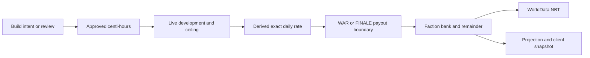

# Build approval → development → population payout

[Index](../INDEX.md) · [Build/population guide](../systems/build-population/README.md)

1. Trigger: [KOMEPacketBuildAction](../../../src/main/java/kome/common/network/KOMEPacketBuildAction.java) or [KOMECommandBuild](../../../src/main/java/kome/common/command/KOMECommandBuild.java) calls [KOMEBuildService](../../../src/main/java/kome/common/data/KOMEBuildService.java) with server-resolved actor/authority. Creation checks [geographic placement](../systems/geography/README.md); submissions and manager review alter approved time, not the spendable bank directly.
2. Live processing: [KOMEEvents.processCampaignTick](../../../src/main/java/kome/common/data/KOMEEvents.java) reaches [KOMEPopulationPayoutRuntime.onLiveCheck](../../../src/main/java/kome/common/data/KOMEPopulationPayoutRuntime.java). Development runs first through [KOMEPopulationDevelopmentService.processLiveDueBoundaries](../../../src/main/java/kome/common/data/KOMEPopulationDevelopmentService.java), with eligible control/owner and rate-ceiling checks.
3. State change: [KOMEPopulationRateService.getExactDailyPopulationRates](../../../src/main/java/kome/common/data/KOMEPopulationRateService.java) derives current exact rates. [KOMEPopulationPayoutProcessor.processLiveDueBoundaries](../../../src/main/java/kome/common/data/KOMEPopulationPayoutProcessor.java) preflights a boundary, applies phase-gated bank credit/remainder and advances its cursor. [Campaign phase](../systems/campaign-lifecycle/README.md) and development timing are separate gates.
4. Persistence: Build contributions/developed time, faction banks, development state and payout cursor/remainders serialize through [KOMEWorldData.writeToNBT](../../../src/main/java/kome/common/data/KOMEWorldData.java). `markDirty` requests a later world save; it is not an immediate disk checkpoint.
5. Client: [KOMEPopulationProjection](../../../src/main/java/kome/common/data/KOMEPopulationProjection.java) and [KOMEPacketConquestData](../../../src/main/java/kome/common/network/KOMEPacketConquestData.java) supply map/Tile Command values. Inspect [network publication](../systems/client-network/README.md) separately from successful arithmetic.

Verification: [precise Build](../../../src/test/java/kome/common/data/KOMEPreciseBuildTest.java), [development](../../../src/test/java/kome/common/data/KOMEPopulationDevelopmentServiceTest.java), [payout](../../../src/test/java/kome/common/data/KOMEPopulationPayoutProcessorTest.java), [projection](../../../src/test/java/kome/common/data/KOMEPopulationProjectionTest.java), and [packet](../../../src/test/java/kome/common/network/KOMECanonicalBuildPacketTest.java) tests; commands are in the system guide. Compare exact units and saved cursors on live boundary/restart. Startup can catch up population according to policy but skips offline development; sequential loops do not reconstruct an independently saved historical rate for every boundary.
