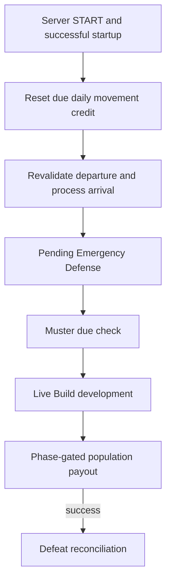

# Server cadence, daily credit, movement, and campaign consequences

[Index](../INDEX.md) · [Movement](../systems/strategic-movement/README.md) · [Campaign lifecycle](../systems/campaign-lifecycle/README.md)

1. Trigger: [KOMEEvents.onServerTick](../../../src/main/java/kome/common/data/KOMEEvents.java), START, initializes each world data instance, then drains authenticated [KOME requests](../systems/client-network/README.md). Shared canonical data is deduplicated for the roughly one-second campaign pass. Waypoint/marker publication and alliance lifecycle reconciliation are adjacent work, not a single atomic daily transaction.
2. Startup gate: [KOMEPopulationPayoutRuntime.onStartup](../../../src/main/java/kome/common/data/KOMEPopulationPayoutRuntime.java) initializes/skips development, applies configured population catch-up, and anchors the movement schedule. Startup does not grant credit for every missed movement day.
3. Reset and coordinated path: [KOMESeasonResetService.active](../../../src/main/java/kome/common/data/KOMESeasonResetService.java) diverts the active reset to its durable return/recovery authority before governance or ordinary movement. Otherwise [KOMEGovernanceService.reconcile](../../../src/main/java/kome/common/data/KOMEGovernanceService.java) runs, then [KOMEDailyCoordinator.process](../../../src/main/java/kome/common/data/KOMEDailyCoordinator.java) through the payout runtime. The journal checkpoints development before payout and claims the summary before notification. If companies/orders, active conflicts, hired-unit casualty needs or due undelivered reserves require unavailable owning adapters, the coordinator records a blocked reason and retains legacy processing; it does not claim the full ordered campaign batch complete.
4. Fallback live order: `processCampaignTick` calls [KOMECommandTroops.resetDailyMovementAllowances](../../../src/main/java/kome/common/command/KOMECommandTroops.java), then `processMovementTick`, pending Emergency Defense, muster due processing, development/payout via `onLiveCheck`, and defeat reconciliation only after a successful payout result. Safe stewardship demobilization follows outside that method.
5. Departure/arrival: movement checks the current effective [graph and passage](../systems/geography/README.md), company authority, phase, and [KOMEMovementDepartureGuard.evaluate](../../../src/main/java/kome/common/data/KOMEMovementDepartureGuard.java) before staging/credit spending. `processArrivals` preflights [conflict receipts and placement](../systems/conflict-tactical/README.md), restores NPC/mount snapshots with preserved identity/health, then commits location/hold/history and schedules remaining steps. Failed physical placement remains retryable/pending according to the order's state.
5. Persistence/sync: company credit, movement boundary/order/history, hired snapshots and conflict commitments serialize through [KOMEWorldData](../../../src/main/java/kome/common/data/KOMEWorldData.java); spawned entities/chunks save separately. Conquest/company projections and [KOMEPacketUnitMapMarkers](../../../src/main/java/kome/common/network/KOMEPacketUnitMapMarkers.java) communicate visible location.

Verification: [boundary ordering](../../../src/test/java/kome/common/command/KOMECampaignBoundaryMovementTest.java), [credit](../../../src/test/java/kome/common/data/KOMEMovementAllowanceTest.java), [departure](../../../src/test/java/kome/common/command/KOMEMovementDepartureGuardTest.java), [queued barrier/recovery](../../../src/test/java/kome/common/command/KOMEMountainBarrierRecoveryTest.java), [movement](../../../src/test/java/kome/common/command/KOMECommandTroopsMovementTest.java). Check direct command/recovery and tick paths, cold restart, mounted HP/UUIDs, and client marker position separately. Conflict end produces paused holds; explicit release/resume and specialized exterior placement remain unwired seams. Reset/return is now routed to its production service; use [reset deployment tests](../../../src/test/java/kome/common/data/KOMESeasonResetDeploymentTest.java) and [daily coordinator tests](../../../src/test/java/kome/common/data/KOMEDailyCoordinatorTest.java) for the changed journal/return boundaries. Owning movement/coordinator integration and full battle/event adapters remain separate dependencies. The diagram retains the fallback path; it is not the complete coordinated/reset dispatch.
