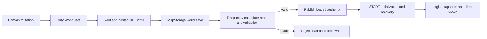

# Save/load across strategic and integrated state

[Index](../INDEX.md) · [Runtime/state guide](../systems/runtime-state/README.md)

1. Trigger: domain mutations dirty [KOMEWorldData](../../../src/main/java/kome/common/data/KOMEWorldData.java); normal Minecraft `MapStorage` saving calls `writeToNBT`. Server lookup `get` loads/creates `KOME_ServerRules`; server START subsequently invokes `initializeIntegratedWorld`.
2. Write authority: root schema 12 writes independent population/development/payout, Builds, companies/movement/credit, progression, public waypoint, diplomacy/war/season, muster/capital, conflict/tactical, Emergency Defense, governance, season-reset/daily journals and audit sections. ConflictData v2 includes Join Battle deployment receipts; nested versions remain independent. Follow each owning guide for nested versions/invariants; do not substitute README's historical schema table.
3. Load validation: `readFromNBT` deep-copies input into a candidate, validates sections and cross-links, rebuilds roles, then `publishLoadedState` publishes the candidate. Malformed mandatory state rejects loading and blocks writing; fresh empty roots use a separate initialization path. Do not convert a rejected save into fresh defaults.
4. Startup recovery: [KOMEEvents](../../../src/main/java/kome/common/data/KOMEEvents.java), [KOMEPopulationPayoutRuntime.onStartup](../../../src/main/java/kome/common/data/KOMEPopulationPayoutRuntime.java), movement reconciliation/join hooks, and module lifecycles restore/anchor current session state. [Daily flow](daily-movement.md) explains which offline work is caught up or skipped.
5. Durable mutation checkpoints: [KOMEWorldCheckpoint](../../../src/main/java/kome/common/data/KOMEWorldCheckpoint.java) persists reset/daily intent and progress before acknowledged effects. [KOMESeasonResetDeployment](../../../src/main/java/kome/common/data/KOMESeasonResetDeployment.java) reconciles original survivor/mount identities, partial HP, chunk receipts and physical locator invalidation; queued-unload copies are separate from active duplicates. Inspect root and Anvil persistence independently.
6. Additional saves: native LOTR player/faction data, hired NPC/mount chunks, [character persisted player NBT and skin files](../systems/character-creation/README.md), [gate tile/ownership and ram crew ledgers](../systems/physical-siege/README.md), and [Mumak/pickup state](../systems/integrated-mobs/README.md) persist independently. One root NBT round trip does not prove atomic consistency across those files.
7. Client recovery: [KOMEClientProxy](../../../src/main/java/kome/client/KOMEClientProxy.java) clears transient session state; login/change-dimension and [packet publication](../systems/client-network/README.md) repopulate views. Diagnose missing server state separately from stale or absent client data.

Verification: [atomic load](../../../src/test/java/kome/common/data/KOMEWorldDataAtomicLoadTest.java), [root schema](../../../src/test/java/kome/common/data/KOMEWorldDataSchemaTest.java), [conflict persistence](../../../src/test/java/kome/common/data/KOMEConflictPersistenceTest.java), [progression schema](../../../src/test/java/kome/common/data/KOMEProgressionSchemaTest.java), [muster](../../../src/test/java/kome/common/data/KOMEMusterServiceTest.java), and owning system tests. Guide commands are valid after build prerequisites. On a disposable world compare serialized records, then save/stop/cold restart and inspect physical entity/tile/player state plus client projections. Preserve the source NBT on failure and record explicit PASS/FAIL evidence; no full runtime save/load was launched for this documentation change.
