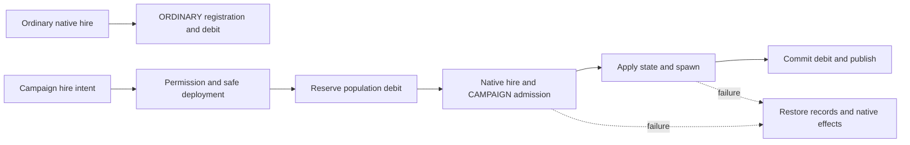

# Native and campaign troop hiring

[Index](../INDEX.md) · [Hiring guide](../systems/hiring-companies/README.md)

1. Trigger: ordinary native LOTR hire observations enter [KOMEEvents](../../../src/main/java/kome/common/data/KOMEEvents.java); explicit campaign hiring enters [KOMEPacketCampaignHire](../../../src/main/java/kome/common/network/KOMEPacketCampaignHire.java) → [KOMENativeTraderCampaignRecruitment](../../../src/main/java/kome/common/data/KOMENativeTraderCampaignRecruitment.java) → [KOMECampaignRecruitmentService.recruit](../../../src/main/java/kome/common/data/KOMECampaignRecruitmentService.java). Server identity, [progression](../systems/progression/README.md), native eligibility/payment, and [tile/capital selection](../systems/campaign-lifecycle/README.md) must be traced for that path.
2. Authority: [KOMEUnitPopulationCostService.calculate](../../../src/main/java/kome/common/data/KOMEUnitPopulationCostService.java) supplies cost; [KOMEPopulationService.beginCombatHireDebit](../../../src/main/java/kome/common/data/KOMEPopulationService.java) supplies the [faction bank](../systems/build-population/README.md) debit. Campaign `execute` resolves legal/safe deployment, reserves debit, performs native hire, assigns CAMPAIGN class, admits the company, applies physical state, and spawns. Failure restores company/record/audit state and rolls back native effects/debit.
3. Ordinary branch: [KOMENativeHireRegistrationService.registerOrdinaryCombatHire](../../../src/main/java/kome/common/data/KOMENativeHireRegistrationService.java) registers/debits an ORDINARY record; it does not enroll a strategic company. Native special formation trades have their own [integrated-module](../systems/integrated-mobs/README.md) behavior.
4. Persistence: [KOMEHiredUnitRecord](../../../src/main/java/kome/common/data/KOMEHiredUnitRecord.java), company membership and bank investment save in [KOMEWorldData](../../../src/main/java/kome/common/data/KOMEWorldData.java); actual NPC/mounts save in chunks. The in-process rollback is not a cross-file crash-atomic transaction.
5. Client: successful campaign recruitment dirties data and calls `syncConquestTiles`; native entity tracking and refreshed company/population views are independent [presentation checks](../systems/client-network/README.md).

Verification: [recruitment transaction](../../../src/test/java/kome/common/data/KOMECampaignRecruitmentServiceTest.java), [packet](../../../src/test/java/kome/common/network/KOMEPacketCampaignHireTest.java), [ordinary registration](../../../src/test/java/kome/common/data/KOMENativeHireRegistrationServiceTest.java), [cost](../../../src/test/java/kome/common/data/KOMEUnitPopulationCostServiceTest.java), [permanent spending](../../../src/test/java/kome/common/data/KOMEPopulationPermanentSpendTest.java). Use guide commands, then disposable hire/failure/reload checks for bank, UUID, class, company, and mount. Cost reduction/death/dismissal does not automatically refund the investment; Emergency Defense reserves follow a separate policy.
