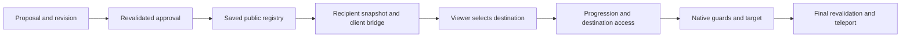

# Proposal approval → visible waypoint → final travel

[Index](../INDEX.md) · [Waypoint guide](../systems/waypoints/README.md)

1. Proposal/approval trigger: [KOMECommandConquest](../../../src/main/java/kome/common/command/KOMECommandConquest.java) enters [KOMEPublicWaypointRegistry.propose](../../../src/main/java/kome/common/data/KOMEPublicWaypointRegistry.java), `adjust`, `approveProposal`. Approval revalidates revision, exact [tile containment](../systems/geography/README.md), and registry constraints before changing approved identity/history.
2. Persistence/publication: registry records/proposals/revision/history save in the `PublicWaypoints` [WorldData](../../../src/main/java/kome/common/data/KOMEWorldData.java) section. [KOMEPublicWaypointSync](../../../src/main/java/kome/common/network/KOMEPublicWaypointSync.java) sends chunked recipient views; [KOMEPublicWaypointClientState](../../../src/main/java/kome/common/data/KOMEPublicWaypointClientState.java) rebuilds client registry/native bridges. Approval is not proof of packet delivery or visibility.
3. Travel trigger: map/native waypoint selection reaches either native LOTR hooked requests or [KOMEPacketWaypointTravelRequest](../../../src/main/java/kome/common/network/KOMEPacketWaypointTravelRequest.java). [KOMEProgressionPermissions](../../../src/main/java/kome/common/data/KOMEProgressionPermissions.java) and [KOMEWaypointAccessService.evaluatePlayer](../../../src/main/java/kome/common/data/KOMEWaypointAccessService.java) check the viewer and destination; native config/progression/cooldown/attack/sleep constraints still apply.
4. Final authority: [KOMEWaypointTransformer](../../../src/main/java/kome/core/KOMEWaypointTransformer.java) and [KOMEPublicWaypointTransformer](../../../src/main/java/kome/core/KOMEPublicWaypointTransformer.java) connect native request/final travel policy, including `allowFinalTravel`. Native LOTR player data owns the selected target and actual teleport, so acceptance must reach final travel rather than stop at the request.
5. Visible outcome: inspect [client projection](../systems/client-network/README.md) for approval/reconnect visibility and [progression](../systems/progression/README.md) for unlock eligibility. A stored server unlock, progression screen summary, and `KOMEClientData.progressions` are separate observations in this baseline.

Verification: [workflow](../../../src/test/java/kome/common/data/KOMEWaypointWorkflowTest.java), [access](../../../src/test/java/kome/common/data/KOMEWaypointAccessServiceTest.java), [sync](../../../src/test/java/kome/common/network/KOMEPublicWaypointSyncTest.java), [native transformer](../../../src/test/java/kome/core/KOMEWaypointTransformerTest.java), [public transformer](../../../src/test/java/kome/core/KOMEPublicWaypointTransformerTest.java). Guide commands cover service/protocol boundaries; disposable connected-client travel is needed for visibility, cached permission, and final teleport. No live teleport was exercised for this map.
